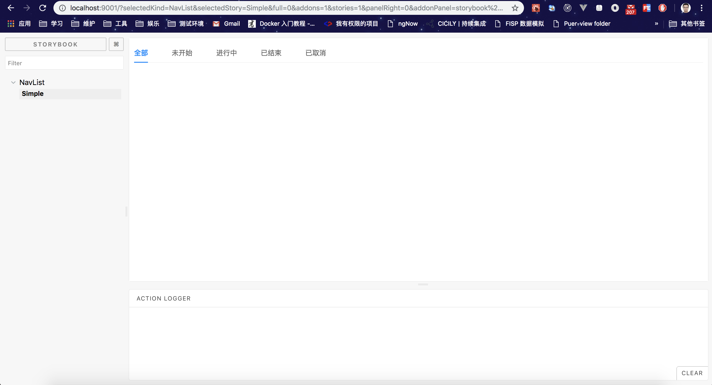

# Sep

Rollup+React+Antd components library（private）.

# Use of Sep

### Sep's source code

First, absolutely run `npm i`.

And then, if you want to get in develop mode, simply run `npm run dev`, this will start storybook to let you overview components. if things goes well, you command line shows information below:

```bash
> sep@1.1.0 dev /usr/local/var/www/Ele/Sep
> start-storybook -p 9001 -c .storybook

info @storybook/react v3.4.11
info
info => Loading custom webpack config (full-control mode).
webpack built 9962dede4114cdd8e152 in 8764ms
info Storybook started on => http://localhost:9001/
info
```

Then open your browser and jump to http://localhost:9001/, and you can see a webpage like this:



if you are developing a new component, modify src/components/stories.js and add your component here, then you will see you component shows on the webpage above.

For more information about storybook, please jump to [storybook](https://storybook.js.org/basics/introduction/).

After a component completed, run `npm run build` and this will create a `sep` folder in root of Sep. The `sep` is what we are going to publish to npm, and what we are going to import to our project.

### Sep's dist code

1. npm i -S sep
2. npm i -D babel-plugin-import
3. .babelrc or babel-loader option

```javascript
// if you are using antd as well, option is an array
"plugins": [
    [
      "import",
      [
        { "libraryName": "antd", "style": true },
        {
          "libraryName": "sep",
          "libraryDirectory": "es",
          "style": true
        }
      ]
    ]
  ]
// if you only use sep, option is an object
"plugins": [
    [
      "import",
        {
          "libraryName": "sep",
          "libraryDirectory": "es",
          "style": true
        }
    ]
  ]
```

## How to develop

### Rules

1. Nameing a component's folder should be all lower-case, and split the words with '-'. For example, a component's name is nav list, we should name the folder as 'nav-list', but the component class, we take `Hungarian notation`, like we name the nav list as NavList.

2. A component class should have to define its props and state interface.

3. A component class should define its propTypes with 'prop-types'.

4. Class names should composed with 'classnames' if it is complex. If a class name is composed with multiple class names, or a class name is dynamic, we call it complex.

5. A component's class name should have a prefix, the prefix defined in defaultProps of the class, naming `prefixCls`.

6. Common styles defined in src/components/style, witch containing color and themes folder. We usually modify themes/default.less witch defines Base styles for most components and Border color and every component's own style and so on, and themes/default.less takes colors from color/colors.less.
